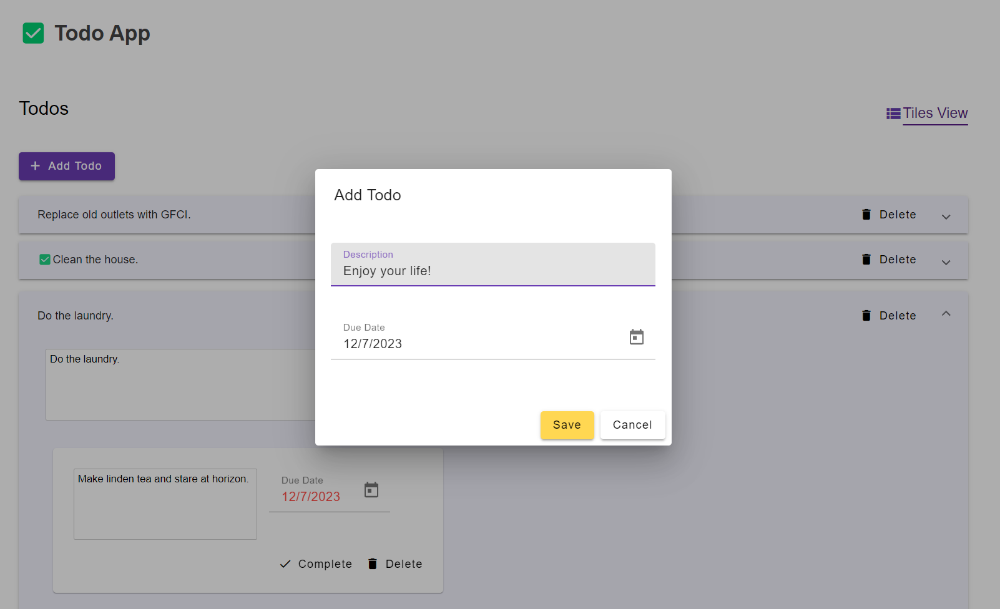

## Todo App - Full stack todo list solution.

#### Todo API Setup
1) Install dotnet 8 SDK - https://dotnet.microsoft.com/en-us/download
2) Download Visual Studio 2022
3) Open the TodoApp.sln
4) Observe the launch options: There are two launch options; In-Memory and Local DB.  

##### Using the DB debug mode 
Using the DB debug mode will create ```TodoAppDb``` in your local database and create a schema and seed the database. 

But the important step is to provide the correct local database server name in ```appsettings.dev-db.json```. It will be in the ```ConnectionStrings``` section. 

The ```ConnectionStrings``` section will contain two connection strings ```DbConnection``` and ```DbConnection```. Both will need your local DB server name.


When application is in DB mode it will register DB repo rather than in memory repo. 

###### API (Swagger) Testing
All API endpoints can be tested via swagger.

### Todo Client App Setup Instructions
1) Install NodeJS and npm 20.10.0 (if doesnt exist) from https://nodejs.org/dist/v20.10.0/node-v20.10.0-x64.msi
2) Verify node & npm installations by checking version in cmd
	```node -v```
	```npm -v```
3) Install Angular CLI globally (if doesn't exist)
	If the execution policy hasn't been enabled previous then run 👇 
	```Set-ExecutionPolicy -Scope CurrentUser -ExecutionPolicy RemoteSigned```
4) Run these npm commands 
- Run ```npm install -g @angular/cli```
- Run ```npm i```
- Run ```npm run local```
- Navigate to http://localhost:4200/


### Application Views 
Application has 2 views; list, and tiles. Please try both views.

##### List View


##### Tiles View


